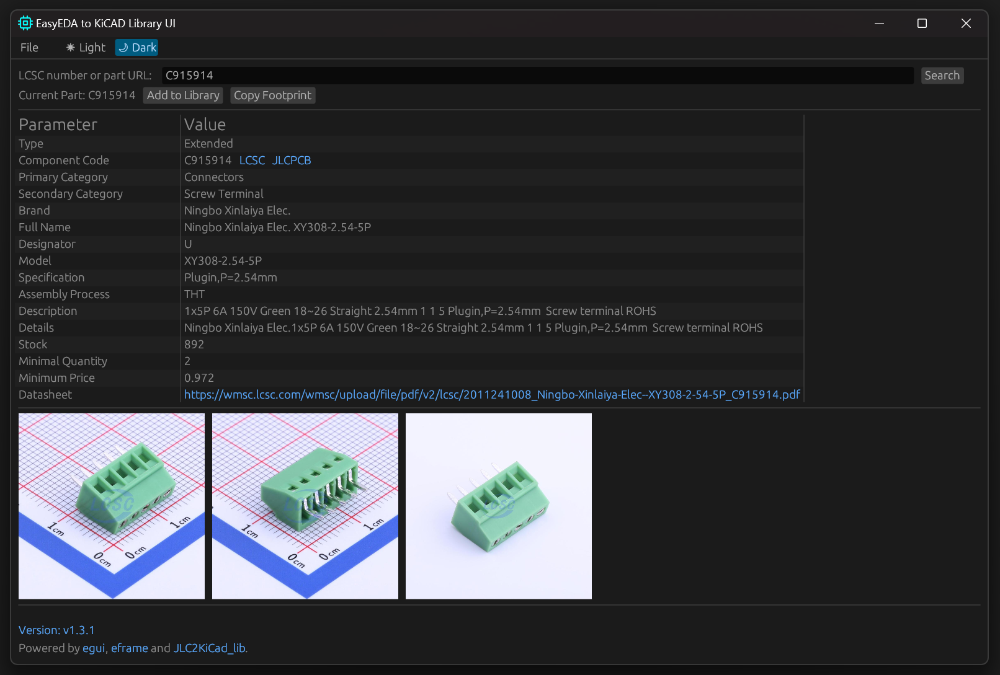
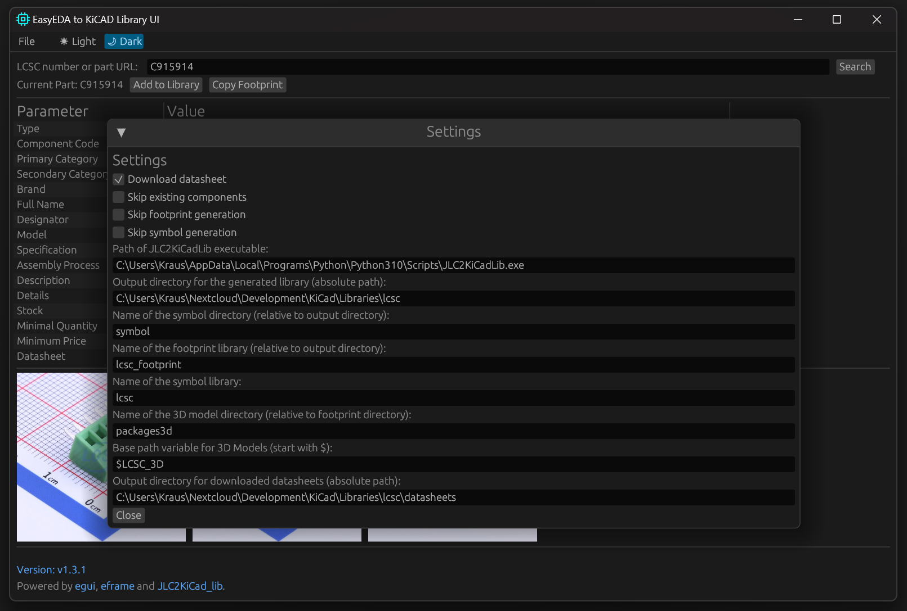

# EasyEDA to KiCAD Library UI

If you like this, a small donation is appreciated:

This is a GUI application written in Rust powered by the awesome egui framework to turn
EasyEDA PCB library components into KiCAD library elements (compatible with KiCAD 6 and upwards).

In the background it builds on the amazing work of the JLC2KICad_lib project to generate
the actual library files.

What it adds on top is a convenient UI to save your settings. Also, you can provide the Cxxxxx 
number from JLCPCB/LCSC directly, or you can drop in either URL from their parts detail pages and the
tool will extract the part number for you.

It also gives you a pretty parts overview to make sure it is what you wanted, and it provides thumbnails
of the pictures LCSC provides of the parts. If you hover over them, you get the full size view.

And it gives you the option to directly open the parts pages, access the datasheet URL (if there is one) and
also save the datasheet in addition to the library conversion.

When using the 'Copy Footprint' button it will download just the footprint and 3D model for the part into a
temporary directory and send it to the clipboard so you can just paste it via Ctrl+V into the KiCAD PCB editor
to check it out and also view the 3d model. The temporary folder will vanish once the application is closed,
so if you commit to using the part use the "Add to Library" function to permanently add it.

## How to get going

You can clone this repository and just run `cargo build --release`, provided you have rust installed (use `rustup`, it's easy).
(release builds will be provided in the future)

Also, you need https://github.com/TousstNicolas/JLC2KiCad_lib
installed on your machine. Install instructions are provided at the linked repo, easiest option is probably via `pip` if Python is already installed.

After you have the prerequisites, launch the application and adjust the settings to your liking, most importantly, provide a valid path to the JLC2KiCad_lib application, either by using an absolute path or making sure it is in your systems $PATH variable.

After entering everything close the program once to save everything.
The application leverages the save state mechanism of egui to persist your settings.

## What this is NOT

- a full featured LCSC library/component browser
- a savior which prevents you from overriding stuff you did not want to override
- a checker that the resulting lib components are actually correct

So, use it as a convenience, but as always: Make sure the output and settings are what you intended and what you need!

